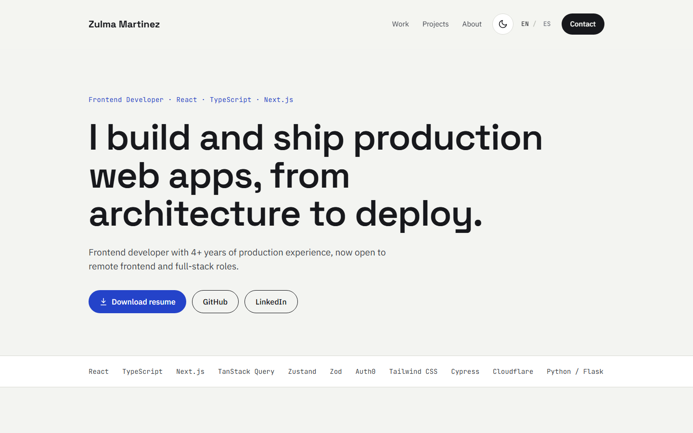
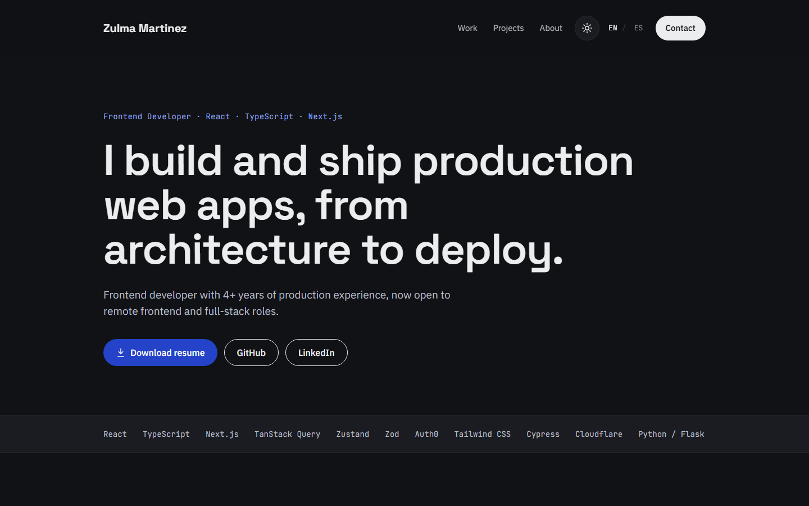
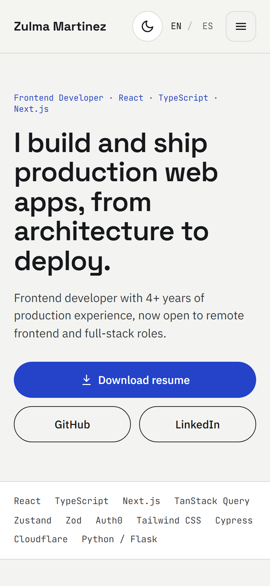
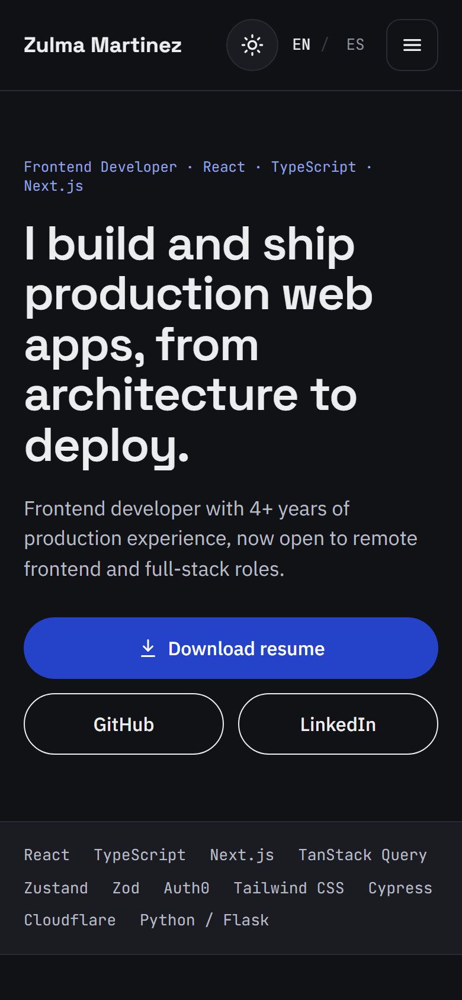

# Zulma Rocio Martinez · Portfolio

Personal portfolio of Zulma Rocio Martinez, frontend developer. A static
Next.js site in English and Spanish, with light and dark themes, deployed on
Cloudflare Pages.

**Live:** https://zulmamartinez.dev

| Light                                                                   | Dark                                                                  |
| ----------------------------------------------------------------------- | --------------------------------------------------------------------- |
|  |  |

<p align="center">
  
  
</p>

Built with Next.js (App Router, static export), React, TypeScript (strict),
Tailwind CSS, Motion, Vitest, Cypress and GitHub Actions. Created from my
[Next.js template](https://github.com/Rocio01/nextjs-template).

Project documents:

- [`docs/brief.md`](docs/brief.md): goals, audience and scope
- [`docs/backlog.md`](docs/backlog.md): sprints and issues
- [`docs/content.md`](docs/content.md): all copy in English and Spanish

## Decisions

**Stack.** The site is one page of content that changes only when I edit it,
so it is a static export: Next.js renders every page at build time, and
Cloudflare Pages serves plain HTML files with no server to run or pay for.
TypeScript runs in strict mode. Tailwind CSS keeps the design tokens in one
place. No UI library and no i18n library: the site is small
enough that they would add more than they save. Motion is used only for the
scroll reveals; everything else is CSS.

**Languages (i18n).** Each language is its own static route, `/en` and `/es`,
built with `generateStaticParams`. The copy lives in two typed dictionaries,
`src/i18n/en.ts` and `src/i18n/es.ts`: the Spanish one has the type of the
English one, so a missing string is a type error. Server components read the
dictionary, so it does not ship to the browser. A static export has no server
to read `Accept-Language`, so `/` redirects in the browser: Spanish if the
first browser language starts with `es`, otherwise English. Each page
declares `<html lang>`, a canonical URL and `hreflang` alternates, and the
language switch links to the same page in the other language.

**Theming.** `src/theme/tokens.css` writes each color once with
`light-dark(light, dark)`, so the two themes cannot drift apart.
`globals.css` maps the tokens to Tailwind utilities such as `bg-bg` and
`text-ink`, and components use only those utilities. On a first visit the
theme follows the system setting (`prefers-color-scheme`). The switch sets
`data-theme` on `<html>` and stores the choice in `localStorage`. A small
inline script in `<head>` applies the stored choice before first paint, so
the page never flashes the wrong theme.

## Requirements

- Node.js 24 (see `.nvmrc`; with nvm, run `nvm use`)
- npm

## Run locally

```sh
npm install
cp .env.example .env.local
npm run dev
```

Open http://localhost:3000.

### Environment variables

| Variable               | Required | Description                                          |
| ---------------------- | -------- | ---------------------------------------------------- |
| `NEXT_PUBLIC_SITE_URL` | Yes      | Public URL of the site, used for SEO and the sitemap |

`src/lib/env.ts` validates the variables with Zod. If a value is missing or
invalid, the build fails with a clear message. The values are inlined at build
time, so a change requires a new build.

## Scripts

| Script                 | What it does                                  |
| ---------------------- | --------------------------------------------- |
| `npm run dev`          | Start the dev server                          |
| `npm run build`        | Build the static site to `out/`               |
| `npm start`            | Serve `out/` on port 3000 (run `build` first) |
| `npm run lint`         | Run ESLint                                    |
| `npm run lint:secrets` | Scan files for leaked secrets with secretlint |
| `npm run typecheck`    | Run the TypeScript compiler without output    |
| `npm test`             | Run unit tests with Vitest                    |
| `npm run test:watch`   | Run Vitest in watch mode                      |
| `npm run test:e2e`     | Build, serve `out/` and run the Cypress tests |
| `npm run format`       | Format all files with Prettier                |

## Test

- **Unit and component tests:** Vitest and Testing Library. Put a test file
  next to the code it tests, named `*.test.ts(x)`. Run `npm test`.
- **End-to-end tests:** Cypress in `cypress/e2e/`. `npm run test:e2e` runs the
  tests against the production build, which is the same output that is
  deployed. To debug in the browser, run `npm run build && npm start`, and in a
  second terminal run `npx cypress open`.

A pre-commit hook (Husky and lint-staged) runs secretlint, ESLint and
Prettier on staged files. CI runs two parallel jobs on each pull request:
`verify` (lint, secret scan, typecheck, unit tests, build) and `e2e` (Cypress
against the static build).

## Project structure

```
src/
  app/          Routes, layouts, metadata, global styles, icon, sitemap, robots
  components/   Reusable UI components and their tests
  sections/     Page sections (header, hero, experience, ...)
  i18n/         Typed dictionaries for English and Spanish
  theme/        Theme logic, design tokens and fonts
  data/         Experience, projects and stack data
  lib/          Logic without UI (env validation, helpers)
cypress/e2e/    End-to-end tests
docs/           Brief, backlog and content
.github/        CI workflow, Dependabot, PR and issue templates
```

## Deploy

Production: https://zulmamartinez.dev (Cloudflare Pages project
`portafolio-2026`, connected to this repository with the Git integration).
The domain is registered with Cloudflare Registrar and attached to the project
under **Custom domains**, with `www.zulmamartinez.dev` as well. The project
is also reachable at https://portafolio-2026.pages.dev; canonical URLs point
to the custom domain.

How a change reaches production:

1. Open a pull request. CI runs `verify` and `e2e`, and Cloudflare builds a
   preview and comments its URL on the pull request.
2. `main` is protected by a ruleset: changes arrive only through pull
   requests, and `verify` and `e2e` must pass before the merge button works.
   Force pushes and deleting `main` are blocked.
3. Merging to `main` deploys to production.

Cloudflare Pages settings:

| Setting                | Value                       |
| ---------------------- | --------------------------- |
| Production branch      | `main`                      |
| Framework preset       | None                        |
| Build command          | `npm run build`             |
| Build output directory | `out`                       |
| `NEXT_PUBLIC_SITE_URL` | `https://zulmamartinez.dev` |

Cloudflare reads the Node.js version from `.nvmrc`. `NEXT_PUBLIC_SITE_URL` is
read at build time: after changing it, retry the latest deployment. Set it in
both Production and Preview.

Analytics: Cloudflare Web Analytics, added under **Analytics & Logs > Web
Analytics** for `zulmamartinez.dev` with automatic setup. Cloudflare injects
the beacon at the edge into HTML served to browsers on the custom domain, so
there is no analytics code in this repository and no cookies. Visits to
`portafolio-2026.pages.dev` are not counted.

To create the project again: **Workers & Pages > Create application**, then
the **"Looking to deploy Pages? Get started"** link at the bottom (the main
flow creates a Worker), then **Import an existing Git repository**.

Notes:

- Do not use the `@cloudflare/next-on-pages` adapter. This site is plain
  static files and needs no adapter.
- Cloudflare serves `out/about.html` at `/about`, so routes work without
  `trailingSlash`.
- Features that need a server (API routes, middleware, server actions, ISR,
  default image optimization) do not work with a static export.

## Secrets

Never commit secrets. Put them in `.env.local`, which is gitignored.

- **secretlint** blocks a commit that contains a known secret format (API
  keys, tokens, private keys). CI runs the same scan on every pull request.
  It ignores `.env*` files except `.env.example`.
- **GitHub secret scanning and push protection** reject a push with a known
  secret. They are free for public repositories. Private repositories need
  GitHub Secret Protection (paid), so secretlint is the free layer that
  always runs.

If a secret reaches a commit, rotate it first (the old value is compromised),
then remove it from the history.
